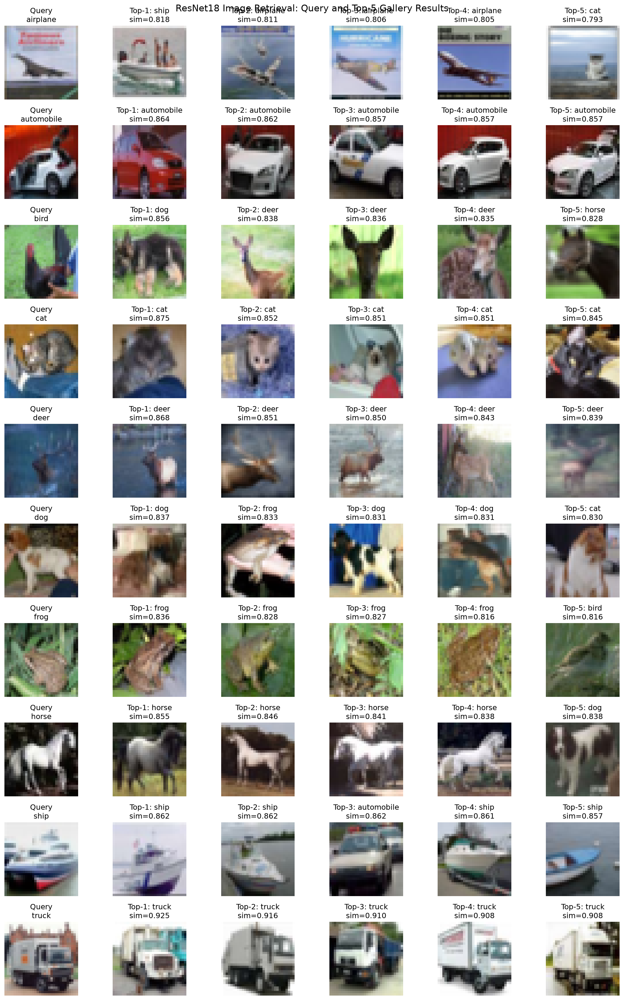
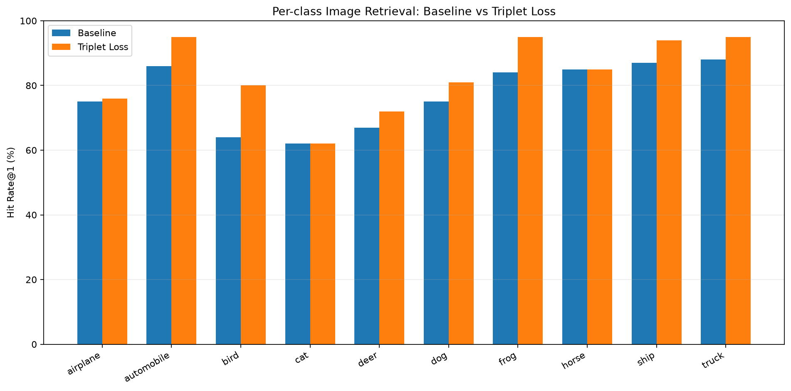
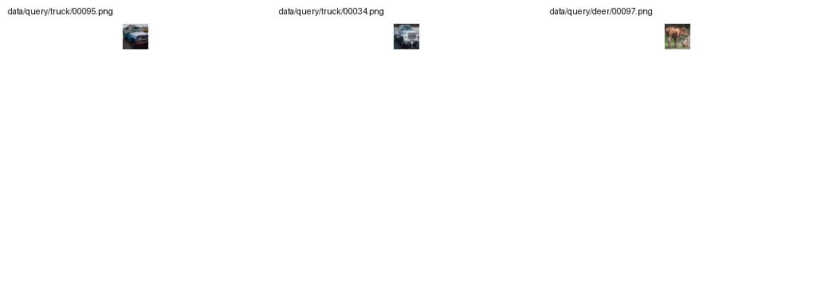

# Week 5 Quiz 1 — Image Retrieval with Triplet Loss

## 1. Overview

This project implements an image retrieval system using a pretrained
ResNet-18 feature extractor and evaluates whether metric learning with
Triplet Loss can improve retrieval performance.

The experiment compares two approaches:

- **Baseline:** Pretrained ResNet-18 feature extraction.
- **Triplet Loss:** Fine-tuning the ResNet-18 `layer4` using batch-hard
  Triplet Loss to improve the embedding space.

The dataset contains 10 CIFAR-10 classes. Each query image is represented
by an embedding and compared with gallery embeddings using cosine
similarity.

## 2. Dataset

| Split | Number of images | Description |
|---|---:|---|
| Gallery | 10,000 | 1,000 images per class |
| Query | 1,000 | 100 images per class |
| Total | 11,000 | 10 classes |

Classes: airplane, automobile, bird, cat, deer, dog, frog, horse, ship,
and truck.

### Feature extraction

- Backbone: ResNet-18 pretrained on ImageNet
- Embedding dimension: 512
- Feature normalization: L2 normalization
- Similarity metric: Cosine similarity
- Image input size: 224 × 224
- Normalization: ImageNet mean and standard deviation

## 3. Method

### 3.1 Baseline

The pretrained ResNet-18 extracts a 512-dimensional feature vector for
each image. The vectors are L2-normalized before computing cosine
similarity between query and gallery images.

For each query, gallery images are ranked by similarity. Retrieval
performance is evaluated using Recall@K.

### 3.2 Triplet Loss Fine-tuning

The Baseline model is fine-tuned using batch-hard Triplet Loss.

| Parameter | Setting |
|---|---|
| Backbone | ResNet-18 |
| Trainable layer | `layer4` |
| Loss function | Batch-hard Triplet Loss |
| Epochs | 5 |
| Batch size | 128 |
| Learning rate | 1e-4 |
| Margin | 0.3 |
| Weight decay | 1e-4 |
| Validation ratio | 0.1 |
| Random seed | 42 |
| Best checkpoint epoch | 3 |

The triplet objective encourages embeddings of images from the same
class to be closer and embeddings from different classes to be farther
apart, subject to the selected margin.

The best checkpoint was saved as
`models/resnet18_triplet_best.pth`.

| Training statistic | Value |
|---|---:|
| Best epoch | 3 |
| Training loss | 0.3425 |
| Validation loss | 0.4006 |

## 4. Evaluation Metrics

**Recall@K** measures the proportion of query images for which at least
one relevant image appears among the top K retrieved gallery results.

A retrieved image is considered relevant when it belongs to the same
class as the query.

## 5. Overall Results

| Metric | Baseline | Triplet Loss | Change |
|---|---:|---:|---:|
| Recall@1 | 77.30% | 83.50% | +6.20 pp |
| Recall@5 | 93.90% | 93.10% | -0.80 pp |
| Recall@10 | 97.80% | 95.90% | -1.90 pp |

*pp = percentage points.*

### Results interpretation

Triplet Loss improved Recall@1 from 77.30% to 83.50%, an increase of
6.20 percentage points. This indicates that the correct class is more
likely to appear at the first retrieval position.

However, Recall@5 decreased by 0.80 percentage points and Recall@10
decreased by 1.90 percentage points. Therefore, the improvement at
rank 1 did not translate into better performance across all retrieval
cutoffs.

## 6. Per-Class Results

The following table reports the proportion of queries with at least one
same-class image in the top K results.

| Class | Baseline @1 | Triplet @1 | Δ pp | Baseline @5 | Triplet @5 | Baseline @10 | Triplet @10 |
|---|---:|---:|---:|---:|---:|---:|---:|
| Airplane | 75% | 76% | +1 | 92% | 85% | 95% | 91% |
| Automobile | 86% | 95% | +9 | 97% | 96% | 100% | 98% |
| Bird | 64% | 80% | +16 | 87% | 90% | 98% | 93% |
| Cat | 62% | 62% | 0 | 90% | 87% | 97% | 92% |
| Deer | 67% | 72% | +5 | 91% | 87% | 98% | 93% |
| Dog | 75% | 81% | +6 | 93% | 97% | 95% | 99% |
| Frog | 84% | 95% | +11 | 96% | 99% | 98% | 100% |
| Horse | 85% | 85% | 0 | 97% | 96% | 99% | 97% |
| Ship | 87% | 94% | +7 | 97% | 97% | 99% | 98% |
| Truck | 88% | 95% | +7 | 99% | 97% | 99% | 98% |

### Key observations

- **Bird:** Recall@1 improved by 16 percentage points, from 64% to 80%.
- **Frog:** Recall@1 improved by 11 percentage points, from 84% to 95%.
- **Automobile:** Recall@1 improved by 9 percentage points, from 86% to 95%.
- **Truck:** Recall@1 improved by 7 percentage points, from 88% to 95%.
- **Airplane:** Recall@5 decreased by 7 percentage points.
- **Cat and Horse:** Recall@1 remained unchanged.

These results suggest that the effects of Triplet Loss vary across
classes and retrieval cutoffs.

## 7. Visualizations

### Baseline Retrieval Results



### Per-Class Top-1 Comparison



### Triplet Loss Failure Cases



## 8. Error Analysis

Additional analyses were conducted to investigate class confusion and
query-level retrieval failures.

### Truck vs. Automobile

For the 100 Truck queries:

| Model | Correct Top-1 | Predicted Automobile |
|---|---:|---:|
| Baseline | 88 | 5 |
| Triplet Loss | 95 | 4 |

Triplet Loss improved Truck Top-1 accuracy from 88% to 95%, while the
number of Truck queries classified by retrieval as Automobile decreased
from 5 to 4.

Nevertheless, individual failure cases still exist. For example, one
Truck query that ranked first correctly under the Baseline model had
Automobile images dominate the Triplet model's top-10 results.

### Deer vs. Horse

For the 100 Deer queries:

| Model | Correct Top-1 | Predicted Horse |
|---|---:|---:|
| Baseline | 67 | 12 |
| Triplet Loss | 72 | 12 |

Deer Top-1 accuracy increased from 67% to 72%, but the number of queries
whose top-ranked result belonged to Horse remained 12.

This suggests that the Deer-Horse confusion remains an area for further
investigation.

The examples above illustrate that aggregate performance and individual
query behavior can differ. A small number of severe ranking failures
may coexist with improved overall Recall@1.

## 9. Project Structure

```text
quiz1/
├── models/
│   ├── resnet18_extractor.py
│   └── resnet18_triplet_best.pth
├── scripts/
│   ├── prepare_dataset.py
│   ├── build_gallery.py
│   ├── retrieve_images.py
│   ├── train_resnet18_triplet.py
│   ├── evaluate_triplet.py
│   ├── analyze_class_metrics.py
│   ├── analyze_cat_bird_errors.py
│   └── inspect_triplet_failures.py
├── results/
│   ├── retrieval_metrics.json
│   ├── triplet_retrieval_metrics.json
│   ├── retrieval_comparison.json
│   ├── class_metrics_comparison.csv
│   ├── query_margin_diagnostics.csv
│   ├── top5_results.csv
│   ├── triplet_top5_results.csv
│   ├── top5_retrieval.png
│   ├── class_hit_rate_at1.png
│   └── triplet_failure_queries.jpg
└── README.md
```

## 10. Limitations and Future Work

1. **Gallery overlap:** The Triplet Loss training split was sampled from
   the gallery. Consequently, some gallery images used for retrieval
   evaluation were also used during training. The current results should
   not be interpreted as a fully held-out gallery generalization result.

2. **Metric trade-offs:** Recall@1 improved, while Recall@5 and Recall@10
   decreased. Further experiments are needed to determine whether the
   ranking behavior can be improved consistently across K values.

3. **Class-dependent behavior:** Some classes improved substantially,
   while others showed little improvement or lower Recall@5 and
   Recall@10. Additional class-wise analysis may help explain these
   differences.

4. **Generalization evaluation:** A future experiment should use a
   training/validation split that is separate from the final evaluation
   gallery, ensuring that the final gallery contains no images used
   during Triplet Loss training.

## 11. Conclusion

This experiment compared pretrained ResNet-18 image retrieval with
ResNet-18 fine-tuned using batch-hard Triplet Loss.

Triplet Loss increased overall Recall@1 from 77.30% to 83.50%.
However, Recall@5 and Recall@10 decreased slightly, showing that
improvements at the first retrieval position do not necessarily imply
improvements across the entire top-K ranking.

The results demonstrate the potential of metric learning for image
retrieval while highlighting the importance of class-wise evaluation,
failure analysis, and a strictly held-out evaluation gallery.
